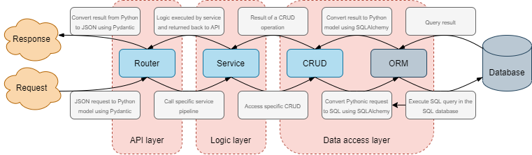
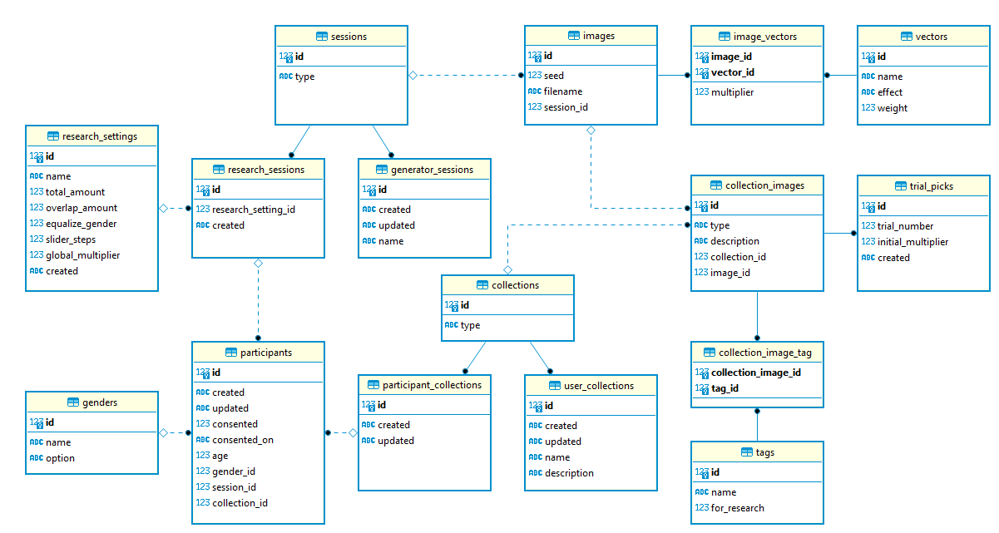

# Manganace backend

## Tech-stack and dependencies
- The project is running on Python 3.7.x
- The GAN model requires TensorFlow 1.14 and higher versions are not supported.
- The API provider is [FastAPI](https://fastapi.tiangolo.com/).
- The incoming and outgoing HTTP messages are mapped to and from Python by [Pydantic](https://pydantic-docs.helpmanual.io/).
- The ORM (Object–relational mapping) is provided by [SQLAlchemy](https://docs.sqlalchemy.org/en/13/) to interact with a database.

To see all the dependencies of the project, please check out the [Pipfile](Pipfile).
To understand the dependencies of the GAN model you can look into the [Stylegan2 github repository](https://github.com/NVlabs/stylegan2).

## How to setup

There are two parts to the setup - setup the GAN model and setup the project.
The former one being the most difficult.
In advance I have to apologize for the Linux users because I personally developed everything on Windows, therefore, I can only provide the steps that I took.
Nevertheless, it should be extremely different and the idea is still the same. 

### Setup **Windows 10** to handle the GAN model:

1. [Download CUDA v10.0.130](https://developer.nvidia.com/compute/cuda/10.0/Prod/network_installers/cuda_10.0.130_win10_network)

2. Install CUDA

3. [Download cuDNN v7.6.5.32](https://developer.nvidia.com/compute/machine-learning/cudnn/secure/7.6.5.32/Production/10.0_20191031/cudnn-10.0-windows10-x64-v7.6.5.32.zip).
You will need to create NVIDIA account for NVIDIA Developer Program Membership in order to access the download link.

4. Unzip and move the folder that is inside the unzipped "cuda" directory directly into CUDA v10.0 installation directory.
Folders should match and prompt will ask you to approve the merge.

5. [Download Visual Studio Community 2017](https://my.visualstudio.com/Downloads?q=visual%20studio%202017&wt.mc_id=o~msft~vscom~older-downloads) (version 15.9) (I found that newer versions are **not** compatible i.e. VS 2019)

6. Launch the VS 2017 installer and when prompted to choose workloads, go to __Individual Components__ tab. 
There, scroll down to __Compilers, build tools and runtimes__, search and select __VC++ 2015.3 v14.00 (v140) toolset for desktop__ and then install Visual Studio.

### Setup the project

The project contains `Pipenv` file with all the dependencies thus the installation of them is one line call in the terminal.
I assume you already have some Python version installed on your machine and have `pip` available for you.
Otherwise, just [install the latest Python](https://www.python.org/downloads/).

1. [Install pipenv](https://pipenv.pypa.io/en/latest/install/) with the preferred method.
For example you can just run:
    > pip install pipenv

2. Open the terminal inside the `backend` folder.

3. Run:
    > pipenv install

In addition to the steps above you will need to place pickled model and vectors in the following way:

1. [Download the FFHQ model](https://nvlabs-fi-cdn.nvidia.com/stylegan2/networks/stylegan2-ffhq-config-f.pkl).
This is the pickled GAN model developed and trained by NVIDIA.

2. Download the emotion vectors.

3. Place both files under `backend/_pickles` folder. If necessary create the `_pickles` folder yourself.

After completing all the steps above, the project should be ready to launch.

## API

I chose [FastAPI](https://fastapi.tiangolo.com/) as an API provider due to the fact that it has an inbuilt OpenAPI specification using [Swagger UI](https://github.com/swagger-api/swagger-ui) and even additional one using [ReDoc](https://github.com/Redocly/redoc).
This means that by launching the project you have full documentation of the API out of the box.
You can access this documentation with Swagger UI by going to `http://127.0.0.1:8000/docs` or  ReDoc UI by going to `http://127.0.0.1:8000/redoc`.

## Application flow

Although the flow diagram above explains the general flow and layers of the application, it is not a rule for all API endpoints.
In some cases there is simply no additional logic to execute, thus, for simplicity reasons, the service layer is cut out from the flow and an API endpoint can call the CRUD layer directly.

## Generator service

## Database

Because of the necessity to keep track of all the generated images, a database is used. 
Currently, it is setup to use [SQLite](https://sqlite.org/index.html) database but any database can be easily configured.

In case you have any questions or are continuing the work on this project and require assistance, please do not hesitate to contact me via [my student email](mailto:m.makelis@student.ru.nl).