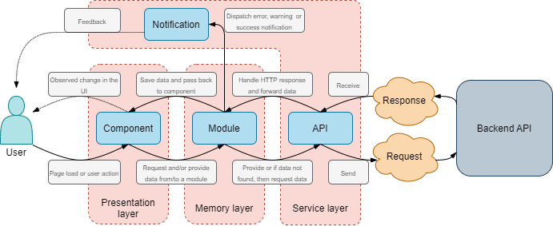

# Manganace frontend

## Tech-stack and dependencies
- Project is running [Vue 3](https://v3.vuejs.org/) using [Composition API](https://vue-composition-api-rfc.netlify.app/)
- Routing is provided by [Vue Router](https://next.router.vuejs.org/).
- The memory store is provided by the in-built Vue 3 reactivity.
- The design is provided by [Ant Design](https://2x.antdv.com/docs/vue/introduce/).

To see all the dependencies of the project, please check out the [package.json](package.json).

## How to setup

The project is using `package.json` where all the dependencies are registered.
In order to use this you need to do the following:

1. [Download Node Package Manager (npm)](https://www.npmjs.com/).

2. Install npm.

3. [Download yarn](https://classic.yarnpkg.com/latest.msi).

4. Install yarn.

5. Open a terminal in the `frontend` directory and run: 
    ```
    yarn install
    ```

After completing all the steps above, the project should be ready to launch.

Use the following command to compile and run with hot-reload for development:
```
yarn serve
```

Use the following command to compile and minify for production:
```
yarn build
```

Use the following command to lint and fix files, although if you use [Visual Studio Code](https://code.visualstudio.com/) for development and install [Vetur](https://marketplace.visualstudio.com/items?itemName=octref.vetur) extension then it should lint mistakes in the IDE.
```
yarn lint
```

## Development environment

There are many ways to edit and work with the code, nevertheless, my preferred way is to run the project in [Visual Studio Code](https://code.visualstudio.com/).
I use the following extensions to make life easy:

1. [Vetur](https://marketplace.visualstudio.com/items?itemName=octref.vetur) for Vue syntax checks and linting.
2. [ESLint](https://marketplace.visualstudio.com/items?itemName=dbaeumer.vscode-eslint) for Javascript syntax checks and linting.
3. [Auto Close Tag](https://marketplace.visualstudio.com/items?itemName=formulahendry.auto-close-tag) and [Auto Rename Tag](https://marketplace.visualstudio.com/items?itemName=formulahendry.auto-rename-tag) for easy HTML writing.
4. [SCSS Formatter](https://marketplace.visualstudio.com/items?itemName=sibiraj-s.vscode-scss-formatter) for SCSS writing.
5. [Path Intellisense](https://marketplace.visualstudio.com/items?itemName=christian-kohler.path-intellisense) for auto-completion on paths e.g. for import statements.
6. [IntelliSense for CSS class names in HTML](https://marketplace.visualstudio.com/items?itemName=Zignd.html-css-class-completion).

**NOTE:** 
On the other hand, if you want to use [PyCharm](https://www.jetbrains.com/pycharm/) because then you can work in a single IDE, then install [Vue.js](https://plugins.jetbrains.com/plugin/9442-vue-js) plugin to handle Vue.

## Application flow



The above graph indicates the general asynchronous HTTP call flow in the project.
Note that the graph is not accurate and excludes the Vue router and any interaction between components, nevertheless, it explains the structure of the project.  

In case you have any questions or are continuing the work on this project and require assistance, please do not hesitate to contact me via [my student email](mailto:m.makelis@student.ru.nl).